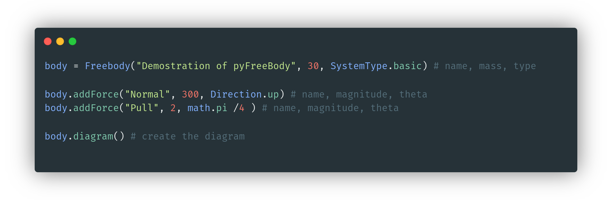

# pyFreeBody
Sole most advanced and easiest free-body diagram generator for Python 🔲
# Installation
```pip3 install pyfreebody```
Continues in documentation
# Usage
The following system setup produces [this output](./examples/simple.out.png). Please view documentation [here](./docs.org)


